# SWES — Entity Relationship Diagram

```mermaid
erDiagram

  %% ── AUTH & USERS ──────────────────────────────────────────────────────────

  users {
    uuid    id PK
    varchar username UK
    varchar email UK
    varchar password_hash
    varchar full_name
    boolean is_active
    boolean is_locked
    timestamptz created_at
    timestamptz updated_at
  }

  roles {
    smallint id PK
    enum     name "ADMIN | OPERATOR"
    text     description
  }

  user_roles {
    uuid     user_id PK,FK
    smallint role_id PK,FK
    timestamptz assigned_at
    uuid     assigned_by FK
  }

  refresh_tokens {
    uuid    id PK
    uuid    user_id FK
    varchar token_hash UK
    timestamptz expires_at
    boolean is_revoked
    timestamptz created_at
  }

  user_sessions {
    uuid    id PK
    uuid    user_id FK
    inet    ip_address
    text    user_agent
    timestamptz login_at
    timestamptz logout_at
  }

  %% ── AGV FLEET ──────────────────────────────────────────────────────────────

  agvs {
    uuid    id PK
    varchar code UK "openTCS vehicle name"
    varchar name
    varchar mac_address
    boolean is_dispatch_enabled
    boolean is_ignored
    smallint operational_battery_threshold
    smallint charging_battery_threshold
    timestamptz created_at
    timestamptz updated_at
  }

  agv_live_status {
    uuid    agv_id PK,FK
    enum    state "IDLE|EXECUTING|CHARGING|ERROR|OFFLINE"
    varchar current_point
    smallint battery_level
    timestamptz last_synced_at
  }

  agv_status_history {
    uuid    id PK
    uuid    agv_id FK
    enum    state
    varchar current_point
    smallint battery_level
    timestamptz recorded_at
  }

  agv_error_history {
    uuid    id PK
    uuid    agv_id FK
    varchar error_code "E_STOP etc."
    text    error_message
    timestamptz occurred_at
    timestamptz resolved_at
  }

  %% ── MAP & TOPOLOGY ─────────────────────────────────────────────────────────

  operation_maps {
    uuid    id PK
    varchar name
    varchar version
    boolean is_active
    text    file_path
    uuid    uploaded_by FK
    timestamptz created_at
  }

  points {
    uuid    id PK
    uuid    map_id FK
    varchar name UK "QR identifier"
    float   x_coord
    float   y_coord
    enum    type "HALT|PARK"
    boolean is_available
    timestamptz created_at
    timestamptz updated_at
  }

  paths {
    uuid    id PK
    uuid    map_id FK
    varchar name UK
    uuid    source_point_id FK
    uuid    dest_point_id FK
    integer max_velocity "mm/s forward; 0=vehicle default"
    integer max_reverse_velocity "mm/s reverse; 0=not allowed"
    float   length "mm"
    boolean is_available
    timestamptz created_at
    timestamptz updated_at
  }

  locations {
    uuid    id PK
    uuid    map_id FK
    varchar name UK
    enum    type "PICKUP|DROPOFF|CHARGE"
    varchar approach_direction "NORTH|SOUTH|EAST|WEST"
    boolean is_available
    timestamptz created_at
    timestamptz updated_at
  }

  location_points {
    uuid     location_id PK,FK
    uuid     point_id PK,FK
    smallint position_index "0=outermost"
  }

  blocks {
    uuid     id PK
    uuid     map_id FK
    varchar  name UK
    enum     type "SINGLE_VEHICLE|SAME_DIRECTION_ONLY|LOCKED"
    smallint max_vehicle_count
    timestamptz created_at
    timestamptz updated_at
  }

  block_members {
    uuid block_id PK,FK
    uuid member_id PK
    enum member_type "POINT|PATH"
  }

  %% ── TRANSPORT REQUEST ──────────────────────────────────────────────────────

  transport_requests {
    uuid    id PK
    varchar request_code UK
    uuid    source_point_id FK
    uuid    destination_location_id FK
    uuid    pickup_point_id FK "calculated"
    uuid    dropoff_point_id FK "calculated"
    uuid    assigned_agv_id FK
    enum    status "PENDING|VALIDATING|INVALID|WAITING_DISPATCH|BLOCKED|DISPATCHING|EXECUTING|COMPLETED|FAILED|CANCELLED"
    text    invalid_reason
    text    no_pickup_reason
    text    no_dropoff_reason
    text    no_assign_reason
    uuid    created_by FK
    timestamptz created_at
    timestamptz assigned_at
    timestamptz started_at
    timestamptz completed_at
    timestamptz cancelled_at
    timestamptz updated_at
  }

  %% ── DISPATCH POLICY ────────────────────────────────────────────────────────

  dispatch_policies {
    uuid    id PK
    varchar name
    float   weight_urgency
    float   weight_proximity
    float   weight_inventory_position
    smallint max_agv_per_block
    boolean is_active
    uuid    created_by FK
    timestamptz created_at
    timestamptz updated_at
  }

  %% ── MONITORING & LOGS ──────────────────────────────────────────────────────

  kpi_snapshots {
    uuid    id PK
    timestamptz snapshot_at
    integer total_requests
    integer completed_requests
    integer failed_requests
    integer cancelled_requests
    float   avg_assign_time_seconds
    float   avg_completion_time_seconds
    smallint active_agv_count
    float   throughput_per_hour
  }

  event_logs {
    uuid    id PK
    enum    event_type "INFO|WARNING|ERROR"
    enum    module "AGV|MAP|TRANSPORT|DISPATCH|AUTH|SYSTEM"
    varchar entity_type
    uuid    entity_id
    text    message
    jsonb   payload
    timestamptz created_at
    uuid    created_by FK
  }

  audit_logs {
    uuid    id PK
    enum    entity_type "AGV|POINT|PATH|LOCATION|BLOCK|TRANSPORT_REQUEST|DISPATCH_POLICY|USER"
    uuid    entity_id
    enum    action "CREATE|UPDATE|DELETE"
    jsonb   old_value
    jsonb   new_value
    uuid    performed_by FK
    timestamptz performed_at
  }

  %% ── RELATIONSHIPS ──────────────────────────────────────────────────────────

  users         ||--o{ user_roles        : "has"
  roles         ||--o{ user_roles        : "assigned to"
  users         ||--o{ refresh_tokens    : "owns"
  users         ||--o{ user_sessions     : "starts"

  agvs          ||--|| agv_live_status   : "has live status"
  agvs          ||--o{ agv_status_history : "history"
  agvs          ||--o{ agv_error_history  : "errors"

  operation_maps ||--o{ points           : "contains"
  operation_maps ||--o{ paths            : "contains"
  operation_maps ||--o{ locations        : "contains"
  operation_maps ||--o{ blocks           : "contains"
  locations      ||--o{ location_points  : "has"
  points         ||--o{ location_points  : "belongs to"
  blocks         ||--o{ block_members    : "has"
  points         ||--o{ paths            : "source"
  points         ||--o{ paths            : "destination"

  transport_requests }o--|| points       : "source point"
  transport_requests }o--|| locations    : "destination"
  transport_requests }o--o| points       : "pickup point"
  transport_requests }o--o| points       : "dropoff point"
  transport_requests }o--o| agvs         : "assigned to"
  users          ||--o{ transport_requests : "creates"

  users          ||--o{ dispatch_policies  : "creates"
  users          ||--o{ event_logs         : "triggers"
  users          ||--o{ audit_logs         : "performs"
  users          ||--o{ operation_maps     : "uploads"
```

## Entity Groups

| Group | Tables |
|-------|--------|
| Auth & Users | `users`, `roles`, `user_roles`, `refresh_tokens`, `user_sessions` |
| AGV Fleet | `agvs`, `agv_live_status`, `agv_status_history`, `agv_error_history` |
| Map & Topology | `operation_maps`, `points`, `paths`, `locations`, `location_points`, `blocks`, `block_members` |
| Transport | `transport_requests` |
| Dispatch | `dispatch_policies` |
| Monitoring & Logs | `kpi_snapshots`, `event_logs`, `audit_logs` |

## Key Design Decisions

- **`location_points.position_index`** — encode thứ tự lấy hàng (0 = outermost), đây là dữ liệu cốt lõi cho pickup dependency logic của FE-04.
- **`agv_live_status`** — bảng riêng 1-1 với `agvs`, tách biệt live state (sync liên tục từ openTCS) khỏi AGV profile (thay đổi ít).
- **`transport_requests.no_assign_reason / no_pickup_reason / no_dropoff_reason`** — hỗ trợ trực tiếp UC-54, UC-57 (hiển thị lý do tắc nghẽn).
- **`paths.max_reverse_velocity`** — ánh xạ trực tiếp từ openTCS `maxReverseVelocity`. Path luôn có hướng (src→dest); `max_reverse_velocity = 0` nghĩa là AGV không được lùi trên path này. "Hai chiều" trong openTCS là tạo 2 path riêng (A→B và B→A), không phải 1 path bidirectional.
- **`point_type_enum`** chỉ có `HALT` và `PARK` — khớp với openTCS `Point.Type`. Business role (pickup/dropoff/charge) được derive từ Location mà point thuộc về qua `location_points`, tránh redundancy và inconsistency.
- **`location_type_enum`** không có `PARK` — parking là point-level concept trong openTCS (`PARK_POSITION`), không phải location.
- **`block_members.member_id`** — không có FK cứng vì member có thể là point hoặc path, phân biệt qua `member_type`.
- **`event_logs.payload JSONB`** — flexible để lưu context bất kỳ mà không cần thêm cột.
- **`dispatch_policies.is_active`** — chỉ một policy active tại một thời điểm (enforce ở application layer).
