# SWES — Entity Relationship Diagram

```mermaid
erDiagram

  %% ── AUTH & USERS ──────────────────────────────────────────────────────────

  users {
    uuid    id PK
    varchar username UK
    varchar email UK
    varchar password_hash
    varchar full_name
    varchar phone
    varchar shift
    text    avatar_url
    boolean mfa_enabled
    boolean is_active
    boolean is_locked
    boolean is_invited
    text    lock_reason
    timestamptz last_login_at
    timestamptz created_at
    timestamptz updated_at
  }

  roles {
    smallint id PK
    enum     name "ADMIN | OPERATOR"
    text     description
  }

  user_roles {
    uuid     user_id PK,FK
    smallint role_id PK,FK
    timestamptz assigned_at
    uuid     assigned_by FK
  }

  refresh_tokens {
    uuid    id PK
    uuid    user_id FK
    varchar token_hash UK
    timestamptz expires_at
    boolean is_revoked
    timestamptz created_at
  }

  user_sessions {
    uuid    id PK
    uuid    user_id FK
    inet    ip_address
    text    user_agent
    timestamptz login_at
    timestamptz logout_at
  }

  password_reset_tokens {
    uuid    id PK
    uuid    user_id FK
    varchar token_hash UK
    timestamptz expires_at
    timestamptz used_at
    timestamptz created_at
  }

  user_preferences {
    uuid    user_id PK,FK
    varchar language "vi | en"
    boolean notifications_enabled
    boolean sound_enabled
    timestamptz updated_at
  }

  %% ── AGV FLEET ──────────────────────────────────────────────────────────────

  agvs {
    uuid    id PK
    varchar code UK "openTCS vehicle name"
    varchar name
    varchar mac_address
    boolean is_dispatch_enabled
    boolean is_ignored
    smallint operational_battery_threshold
    smallint charging_battery_threshold
    timestamptz created_at
    timestamptz updated_at
  }

  agv_live_status {
    uuid    agv_id PK,FK
    enum    state "IDLE|EXECUTING|CHARGING|ERROR|OFFLINE"
    varchar current_point
    smallint battery_level
    timestamptz last_synced_at
  }

  agv_status_history {
    uuid    id PK
    uuid    agv_id FK
    enum    state
    varchar current_point
    smallint battery_level
    timestamptz recorded_at
  }

  agv_error_history {
    uuid    id PK
    uuid    agv_id FK
    varchar error_code "E_STOP etc."
    text    error_message
    timestamptz occurred_at
    timestamptz resolved_at
  }

  %% ── MAP & TOPOLOGY ─────────────────────────────────────────────────────────

  operation_maps {
    uuid    id PK
    varchar name
    varchar version
    enum    status "DRAFT|ACTIVE|ARCHIVED"
    text    file_path
    uuid    uploaded_by FK
    timestamptz created_at
  }

  points {
    uuid    id PK
    uuid    map_id FK
    varchar name UK "QR identifier"
    float   x_coord
    float   y_coord
    enum    type "HALT|PARK"
    boolean is_available
    timestamptz created_at
    timestamptz updated_at
  }

  paths {
    uuid    id PK
    uuid    map_id FK
    varchar name UK
    uuid    source_point_id FK
    uuid    dest_point_id FK
    integer max_velocity "mm/s forward; 0=vehicle default"
    integer max_reverse_velocity "mm/s reverse; 0=not allowed"
    float   length "mm"
    boolean is_available
    timestamptz created_at
    timestamptz updated_at
  }

  locations {
    uuid    id PK
    uuid    map_id FK
    varchar name UK
    enum    type "PICKUP|DROPOFF|CHARGE"
    varchar approach_direction "NORTH|SOUTH|EAST|WEST"
    boolean is_available
    timestamptz created_at
    timestamptz updated_at
  }

  location_points {
    uuid     location_id PK,FK
    uuid     point_id PK,FK
    smallint position_index "0=outermost"
  }

  blocks {
    uuid     id PK
    uuid     map_id FK
    varchar  name UK
    enum     type "SINGLE_VEHICLE|SAME_DIRECTION_ONLY|LOCKED"
    smallint max_vehicle_count
    timestamptz created_at
    timestamptz updated_at
  }

  block_members {
    uuid block_id PK,FK
    uuid member_id PK
    enum member_type "POINT|PATH"
  }

  %% ── TRANSPORT REQUEST ──────────────────────────────────────────────────────

  cargos {
    uuid    id PK
    varchar item_code "barcode from scanner"
    uuid    source_point_id FK
    uuid    destination_location_id FK
    enum    status "ACTIVE|DELIVERED|CANCELLED"
    uuid    created_by FK "null if created via scanner API"
    timestamptz created_at
    timestamptz updated_at
  }

  transport_requests {
    uuid    id PK
    varchar request_code UK
    uuid    cargo_id FK
    uuid    source_point_id FK
    uuid    destination_location_id FK
    uuid    pickup_point_id FK "calculated"
    uuid    dropoff_point_id FK "calculated"
    uuid    assigned_agv_id FK
    enum    status "PENDING|VALIDATING|INVALID|WAITING_DISPATCH|BLOCKED|DISPATCHING|EXECUTING|COMPLETED|FAILED|CANCELLED"
    text    invalid_reason
    text    no_pickup_reason
    text    no_dropoff_reason
    text    no_assign_reason
    uuid    created_by FK
    timestamptz created_at
    timestamptz assigned_at
    timestamptz started_at
    timestamptz completed_at
    timestamptz cancelled_at
    timestamptz updated_at
  }

  %% ── DISPATCH POLICY ────────────────────────────────────────────────────────

  dispatch_policies {
    uuid    id PK
    varchar name
    float   weight_urgency
    float   weight_proximity
    float   weight_inventory_position
    smallint max_agv_per_block
    boolean is_active
    uuid    created_by FK
    timestamptz created_at
    timestamptz updated_at
  }

  %% ── MONITORING & LOGS ──────────────────────────────────────────────────────

  kpi_snapshots {
    uuid    id PK
    timestamptz snapshot_at
    integer total_requests
    integer completed_requests
    integer failed_requests
    integer cancelled_requests
    float   avg_assign_time_seconds
    float   avg_completion_time_seconds
    smallint active_agv_count
    float   throughput_per_hour
  }

  event_logs {
    uuid    id PK
    enum    event_type "INFO|WARNING|ERROR"
    enum    module "AGV|MAP|TRANSPORT|DISPATCH|AUTH|SYSTEM"
    varchar entity_type
    uuid    entity_id
    uuid    correlation_id "group related events"
    text    message
    jsonb   payload
    timestamptz created_at
    uuid    created_by FK
  }

  audit_logs {
    uuid    id PK
    enum    entity_type "AGV|POINT|PATH|LOCATION|BLOCK|TRANSPORT_REQUEST|DISPATCH_POLICY|USER"
    uuid    entity_id
    enum    action "CREATE|UPDATE|DELETE"
    jsonb   old_value
    jsonb   new_value
    uuid    performed_by FK
    timestamptz performed_at
  }

  %% ── RELATIONSHIPS ──────────────────────────────────────────────────────────

  users         ||--o{ user_roles        : "has"
  roles         ||--o{ user_roles        : "assigned to"
  users         ||--o{ refresh_tokens    : "owns"
  users         ||--o{ user_sessions     : "starts"
  users         ||--o{ password_reset_tokens : "requests"
  users         ||--|| user_preferences  : "configures"

  agvs          ||--|| agv_live_status   : "has live status"
  agvs          ||--o{ agv_status_history : "history"
  agvs          ||--o{ agv_error_history  : "errors"

  operation_maps ||--o{ points           : "contains"
  operation_maps ||--o{ paths            : "contains"
  operation_maps ||--o{ locations        : "contains"
  operation_maps ||--o{ blocks           : "contains"
  locations      ||--o{ location_points  : "has"
  points         ||--o{ location_points  : "belongs to"
  blocks         ||--o{ block_members    : "has"
  points         ||--o{ paths            : "source"
  points         ||--o{ paths            : "destination"

  cargos         }o--|| points        : "source point"
  cargos         }o--|| locations     : "destination"
  cargos         ||--o| transport_requests : "triggers"
  users          ||--o{ cargos        : "creates"

  transport_requests }o--o| cargos      : "for cargo"
  transport_requests }o--|| points       : "source point"
  transport_requests }o--|| locations    : "destination"
  transport_requests }o--o| points       : "pickup point"
  transport_requests }o--o| points       : "dropoff point"
  transport_requests }o--o| agvs         : "assigned to"
  users          ||--o{ transport_requests : "creates"

  users          ||--o{ dispatch_policies  : "creates"
  users          ||--o{ event_logs         : "triggers"
  users          ||--o{ audit_logs         : "performs"
  users          ||--o{ operation_maps     : "uploads"
```

## Entity Groups

| Group | Tables |
|-------|--------|
| Auth & Users | `users`, `roles`, `user_roles`, `refresh_tokens`, `user_sessions`, `password_reset_tokens`, `user_preferences` |
| AGV Fleet | `agvs`, `agv_live_status`, `agv_status_history`, `agv_error_history` |
| Map & Topology | `operation_maps`, `points`, `paths`, `locations`, `location_points`, `blocks`, `block_members` |
| Transport | `cargos`, `transport_requests` |
| Dispatch | `dispatch_policies` |
| Monitoring & Logs | `kpi_snapshots`, `event_logs`, `audit_logs` |

## Key Design Decisions

- **`location_points.position_index`** — encode thứ tự lấy hàng (0 = outermost), đây là dữ liệu cốt lõi cho pickup dependency logic của FE-04.
- **`agv_live_status`** — bảng riêng 1-1 với `agvs`, tách biệt live state (sync liên tục từ openTCS) khỏi AGV profile (thay đổi ít).
- **`transport_requests.no_assign_reason / no_pickup_reason / no_dropoff_reason`** — hỗ trợ trực tiếp UC-54, UC-57 (hiển thị lý do tắc nghẽn).
- **`paths.max_reverse_velocity`** — ánh xạ trực tiếp từ openTCS `maxReverseVelocity`. Path luôn có hướng (src→dest); `max_reverse_velocity = 0` nghĩa là AGV không được lùi trên path này. "Hai chiều" trong openTCS là tạo 2 path riêng (A→B và B→A), không phải 1 path bidirectional.
- **`point_type_enum`** chỉ có `HALT` và `PARK` — khớp với openTCS `Point.Type`. Business role (pickup/dropoff/charge) được derive từ Location mà point thuộc về qua `location_points`, tránh redundancy và inconsistency.
- **`location_type_enum`** không có `PARK` — parking là point-level concept trong openTCS (`PARK_POSITION`), không phải location.
- **`block_members.member_id`** — không có FK cứng vì member có thể là point hoặc path, phân biệt qua `member_type`.
- **`event_logs.payload JSONB`** — flexible để lưu context bất kỳ mà không cần thêm cột.
- **`cargos`** — Cargo được tạo trước bởi scanner API (created_by nullable), sau đó trigger tạo transport_request. Một cargo map tối đa một transport_request (`||--o|`). Delete cargo khi task chưa `PICKUP_COMPLETED` cascade cancel transport_request liên kết (enforce ở application layer). `source_point_id` và `destination_location_id` trên `transport_requests` là denormalized copy từ cargo tại thời điểm tạo task — giữ nguyên để tránh join khi cargo bị delete.
- **`dispatch_policies.is_active`** — chỉ một policy active tại một thời điểm (enforce ở application layer).
- **`operation_maps.status`** — enum `DRAFT|ACTIVE|ARCHIVED` thay cho `is_active BOOLEAN`, hỗ trợ versioning lifecycle của WF-07: upload → DRAFT → validate → ACTIVE (chỉ một map ACTIVE tại một thời điểm) → ARCHIVED khi bị thay thế hoặc rollback.
- **`event_logs.correlation_id`** — nullable UUID để nhóm các event liên quan thành một chuỗi (e.g. toàn bộ sự kiện của một transport request, hoặc một withdrawal attempt thất bại). Được nhắc đến trong WF-10 như context bắt buộc khi emit event.
- **`users` mở rộng cho FE-07 UI** — bổ sung `phone`, `shift`, `avatar_url` (hồ sơ cá nhân UC-83/84), `mfa_enabled` (công tắc 2 lớp ở tab Security UC-85), `lock_reason` (hiển thị ở màn quản lý admin), `last_login_at` (denormalize mốc đăng nhập gần nhất để khỏi join `user_sessions` mỗi lần liệt kê).
- **Trạng thái user** — UI hiển thị 4 trạng thái nhưng không thêm enum: suy ra từ cờ boolean theo thứ tự ưu tiên `is_locked → LOCKED`, `is_invited → INVITED`, `is_active → ACTIVE`, còn lại `INACTIVE`. `is_invited` phân biệt "chờ kích hoạt" (vừa mời) với "ngừng hoạt động" (`is_active=false`), vì cả hai đều chưa active.
- **Một vai trò / user (quy ước app-layer)** — `user_roles` vẫn là M:N để mở rộng sau, nhưng UI FE-07 hiện gán đúng **một** role (ADMIN hoặc OPERATOR) cho mỗi user; application layer enforce một dòng `user_roles` cho mỗi user. Giá trị enum DB là HOA (`ADMIN/OPERATOR`), UI map sang thường.
- **`password_reset_tokens`** — bảng riêng cho UC-86 (token đặt lại mật khẩu, một lần, có `expires_at` + `used_at`), tách khỏi `refresh_tokens` của phiên đăng nhập.
- **`user_preferences`** — 1-1 với `users`, lưu `language`, `notifications_enabled`, `sound_enabled` của tab Preferences thay vì để state tạm trên client.
