# Main Workflows (Business Processes)

Tài liệu này mô tả các luồng nghiệp vụ chính (main business processes) của hệ thống WES (Warehouse Execution System) điều phối AGV, được trình bày dưới dạng **swim-lane diagram**. Mỗi workflow gồm: mục tiêu nghiệp vụ, các lane (actor/hệ thống tham gia), điều kiện kích hoạt, sơ đồ swim-lane, mô tả theo từng lane, bảng các bước, luồng ngoại lệ và hậu điều kiện.

## Quy ước chung

**Các lane (actor / hệ thống) xuất hiện trong các sơ đồ:**

- `Operator`: người vận hành tại hiện trường, quét mã và theo dõi vận hành cơ bản.
- `Admin`: người quản trị, cấu hình hệ thống và giám sát điều phối.
- `Barcode Scanner / Handheld App`: thiết bị hoặc client bên ngoài WES dùng để quét QR sàn và barcode kiện hàng. Nếu chỉ là thiết bị nhập liệu, nó hoạt động dưới thao tác của `Operator`; nếu có app/client gọi API sang WES, nó được xem là external input client.
- `WES`: lớp quản lý và điều phối nghiệp vụ (hệ thống đang xây dựng).
- `FMS (openTCS)`: tầng thực thi đội xe (dispatch, routing, execution).
- `AGV`: xe tự hành thực hiện di chuyển và thao tác nghiệp vụ.

**Ký hiệu sơ đồ:** Sơ đồ dùng cú pháp Mermaid `flowchart LR` (flow chạy từ trái sang phải). Mỗi `subgraph` là một lane (làn bơi) được bố trí thành một cột dọc nhờ `direction TB`. Các node là bước xử lý bên trong lane, mũi tên đi ngang giữa các lane thể hiện việc bàn giao trách nhiệm (handoff). Mỗi workflow kèm một bảng các bước với cột `Lane` để truy vết ai/hệ thống nào chịu trách nhiệm từng bước.

---

## WF-01 — Vòng đời yêu cầu vận chuyển (End-to-End Pickup & Delivery)

**Mục tiêu nghiệp vụ:** Đưa một kiện hàng từ điểm lấy hàng đến đúng location trả hàng, từ thao tác quét mã tại hiện trường cho đến khi AGV hoàn tất nhiệm vụ.

**Điều kiện kích hoạt:** Operator sử dụng `Barcode Scanner / Handheld App` hoặc API caller gửi yêu cầu gồm vị trí hiện tại của hàng và `location đích`; tại hiện trường, dữ liệu này thường phát sinh từ thao tác quét QR sàn, quét barcode kiện hàng và chọn hoặc resolve `location đích` từ đơn/hệ thống bên ngoài.

**Tiền điều kiện:** Bản đồ vận hành và location đã được cấu hình; có ít nhất một AGV đủ điều kiện tham gia điều phối.

**Swim-lane diagram:**

```mermaid
flowchart LR
  subgraph OP[Operator]
    direction TB
    A1[Quét QR sàn xác định vị trí hàng] --> A2[Quét barcode trên kiện hàng]
    A2 --> A3["Xác định location đích (barcode/order hoặc chọn thủ công)"]
    A3 --> A4[Gửi yêu cầu vận chuyển qua API]
  end
  subgraph WES[WES]
    direction TB
    B1[Tiếp nhận request: vị trí hàng + location đích] --> B2{Dữ liệu hợp lệ?}
    B2 -- Không --> R1[Ghi nhận yêu cầu không hợp lệ → WF-03]
    B2 -- Có --> B3["Tạo & gán mã yêu cầu vận chuyển"]
    B3 --> B4[Xác định điểm lấy hàng hợp lệ]
    B4 --> B5[Chọn điểm trả hàng theo rule không gian]
    B5 --> B6[Đưa vào hàng đợi điều phối]
    B6 --> B7[Gửi yêu cầu đã chuẩn bị sang FMS]
    B8["Cập nhật trạng thái & lưu mốc thời gian"]
  end
  subgraph FMS["FMS (openTCS)"]
    direction TB
    C1[Nhận yêu cầu thực thi] --> C2[Dispatch: chọn AGV phù hợp]
    C2 --> C3[Routing: tính tuyến đường]
    C3 --> C4[Gửi lệnh điều khiển cho AGV]
    C5[Đồng bộ trạng thái về WES]
  end
  subgraph AGV[AGV]
    direction TB
    D1[Di chuyển đến điểm lấy hàng] --> D2[Thực hiện lấy hàng]
    D2 --> D3[Di chuyển đến điểm trả hàng]
    D3 --> D4[Thực hiện trả hàng]
    D4 --> D5[Báo hoàn tất nhiệm vụ]
  end

  A4 --> B1
  B7 --> C1
  C4 --> D1
  D5 --> C5
  C5 --> B8
```

**Mô tả theo từng lane:**

- **Operator:** Sử dụng `Barcode Scanner / Handheld App` để quét QR dưới sàn nhằm xác định vị trí hiện tại của kiện hàng, quét barcode trên hàng, và xác định `location đích` (resolve từ barcode/đơn hàng, chọn thủ công, hoặc do hệ thống/API caller bên ngoài cung cấp). Gửi hai input tối thiểu (vị trí hàng + location đích) qua API. **Handoff → WES.**
- **WES:** Tiếp nhận request, kiểm tra hợp lệ nghiệp vụ. Nếu không hợp lệ → chuyển WF-03. Nếu hợp lệ → tạo & gán mã, xác định điểm lấy hợp lệ, chọn điểm trả theo rule không gian, đưa vào hàng đợi điều phối. **Handoff → FMS.** Cuối luồng, nhận đồng bộ ngược từ FMS để cập nhật vòng đời và mốc thời gian.
- **FMS (openTCS):** Nhận yêu cầu đã chuẩn bị, dispatch chọn AGV, tính routing, gửi lệnh điều khiển. **Handoff → AGV.** Khi có cập nhật, đồng bộ trạng thái ngược về WES.
- **AGV:** Di chuyển đến điểm lấy, lấy hàng, di chuyển đến điểm trả, trả hàng, báo hoàn tất. **Handoff → FMS** (báo kết quả thực thi).

**Bảng các bước:**

| Bước | Lane | Hành động | Đầu ra / Handoff |
| ---- | ---- | --------- | ---------------- |
| 1 | Operator | Dùng Barcode Scanner / Handheld App quét QR sàn, quét barcode, xác định location đích | Hai input: vị trí hàng + location đích |
| 2 | Operator / Handheld App → WES | Gửi yêu cầu vận chuyển qua API | WES tiếp nhận request |
| 3 | WES | Kiểm tra hợp lệ nghiệp vụ | Hợp lệ → tiếp; không → WF-03 |
| 4 | WES | Tạo & gán mã, xác định điểm lấy, chọn điểm trả | Yêu cầu sẵn sàng điều phối |
| 5 | WES → FMS | Đưa vào hàng đợi & gửi yêu cầu đã chuẩn bị | FMS nhận yêu cầu thực thi |
| 6 | FMS → AGV | Dispatch chọn AGV, routing, gửi lệnh | AGV nhận nhiệm vụ |
| 7 | AGV | Lấy hàng → di chuyển → trả hàng → báo hoàn tất | Hàng ở location đích |
| 8 | FMS → WES | Đồng bộ trạng thái ngược | Cập nhật vòng đời & mốc thời gian |

**Luồng ngoại lệ:**

- Dữ liệu đầu vào không hợp lệ hoặc không có điểm lấy/trả hợp lệ → chuyển WF-03.
- Yêu cầu bị giữ lại quá lâu trong hàng đợi điều phối → xử lý trong WF-02.
- Operator hoặc Admin hủy/dừng yêu cầu ở trạng thái cho phép → xử lý theo WF-09.

**Hậu điều kiện:** Kiện hàng đã ở location đích; yêu cầu vận chuyển ở trạng thái `Completed` cùng đầy đủ mốc thời gian.

---

## WF-02 — Điều phối & xử lý thứ tự lấy hàng (Dispatch Orchestration)

**Mục tiêu nghiệp vụ:** Sắp xếp thứ tự thực hiện yêu cầu sao cho khả thi về mặt vật lý, tránh out-of-order pickup và giảm nhu cầu switch order, đồng thời hạn chế ùn tắc/deadlock.

**Điều kiện kích hoạt:** Có yêu cầu vận chuyển mới được đẩy vào hàng đợi điều phối của WES.

**Tiền điều kiện:** Đã cấu hình chính sách điều phối; topology, block và rule không gian đã sẵn sàng.

**Swim-lane diagram:**

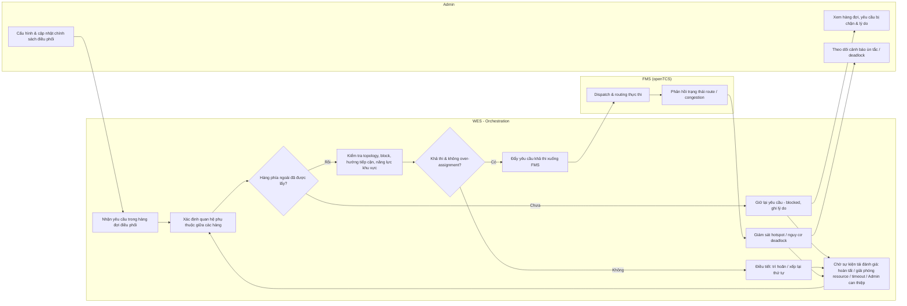

**Mô tả theo từng lane:**

- **Admin:** Cấu hình và cập nhật chính sách điều phối (đầu vào chi phối hành vi sắp xếp của WES); theo dõi hàng đợi, các yêu cầu bị chặn kèm lý do, và các cảnh báo ùn tắc/deadlock. **Handoff → WES.**
- **WES (Orchestration):** Với mỗi yêu cầu, xác định quan hệ phụ thuộc vật lý giữa các hàng trong cùng khu lấy. Vì AGV không đi xuyên qua hàng, nếu hàng phía ngoài chưa được lấy thì yêu cầu lấy hàng phía trong bị giữ (blocked) kèm lý do và chờ sự kiện tái đánh giá (hàng phía ngoài hoàn tất, point/location được giải phóng, FMS phản hồi route mới, quá timeout, hoặc Admin can thiệp). Khi khả thi, kiểm tra topology/block/hướng tiếp cận/năng lực khu vực để tránh over-assignment; nếu chưa đạt thì điều tiết (trì hoãn/xếp lại). Chỉ yêu cầu khả thi mới đẩy xuống FMS. **Handoff → FMS.**
- **FMS (openTCS):** Thực hiện dispatch/routing và phản hồi trạng thái route/congestion. **Handoff → WES** (để giám sát hotspot/deadlock).

**Bảng các bước:**

| Bước | Lane | Hành động | Đầu ra / Handoff |
| ---- | ---- | --------- | ---------------- |
| 1 | Admin → WES | Cấu hình/cập nhật chính sách điều phối | Input chi phối hành vi WES |
| 2 | WES | Nhận yêu cầu, xác định quan hệ phụ thuộc vật lý | Biết hàng nào lấy được trước |
| 3 | WES | Kiểm tra hàng phía ngoài đã lấy chưa | Chưa → giữ blocked + lý do |
| 4 | WES | Chờ sự kiện tái đánh giá (hoàn tất/giải phóng/timeout/Admin) | Quay lại đánh giá khi có sự kiện |
| 5 | WES | Kiểm tra topology, block, hướng tiếp cận, năng lực khu vực | Khả thi → tiếp; không → điều tiết |
| 6 | WES → FMS | Đẩy yêu cầu khả thi xuống thực thi | FMS dispatch/routing |
| 7 | FMS → WES | Phản hồi route/congestion | WES giám sát hotspot/deadlock và tái đánh giá khi cần |
| 8 | WES → Admin | Hiển thị queue, yêu cầu bị chặn, cảnh báo | Admin theo dõi & can thiệp |

**Luồng ngoại lệ:**

- Yêu cầu bị giữ quá ngưỡng thời gian → nâng cảnh báo cho Admin.
- FMS báo route không khả thi/congestion → WES phối hợp điều tiết lại luồng và đưa yêu cầu quay lại bước tái đánh giá.

**Hậu điều kiện:** Yêu cầu được thực thi theo thứ tự khả thi vật lý, giảm thiểu out-of-order pickup và switch order.

---

## WF-03 — Xử lý yêu cầu không hợp lệ / không thể xử lý

**Mục tiêu nghiệp vụ:** Đảm bảo mọi yêu cầu lỗi đều được ghi nhận minh bạch với lý do rõ ràng để Operator/Admin truy vết và xử lý.

**Điều kiện kích hoạt:** Một yêu cầu vận chuyển thất bại ở bước kiểm tra hợp lệ hoặc không tìm được điểm lấy/trả hợp lệ.

**Swim-lane diagram:**

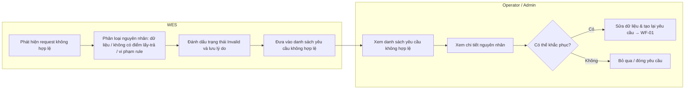

**Mô tả theo từng lane:**

- **WES:** Khi phát hiện request không hợp lệ, phân loại nguyên nhân (dữ liệu sai, không có điểm lấy/trả hợp lệ, vi phạm rule không gian), đánh dấu trạng thái `Invalid` kèm lý do và đưa vào danh sách yêu cầu không hợp lệ. **Handoff → Operator/Admin.**
- **Operator/Admin:** Xem danh sách và chi tiết nguyên nhân. Nếu khắc phục được → sửa dữ liệu và tạo lại yêu cầu (quay về WF-01); nếu không → đóng yêu cầu.

**Bảng các bước:**

| Bước | Lane | Hành động | Đầu ra / Handoff |
| ---- | ---- | --------- | ---------------- |
| 1 | WES | Phát hiện & phân loại nguyên nhân không hợp lệ | Xác định loại lỗi |
| 2 | WES | Đánh dấu `Invalid` + lưu lý do, đưa vào danh sách | Yêu cầu lỗi được lưu vết |
| 3 | WES → Operator/Admin | Hiển thị danh sách & chi tiết nguyên nhân | Người dùng nắm lý do |
| 4 | Operator/Admin | Quyết định: khắc phục hay đóng | Khắc phục → WF-01; không → đóng |

**Hậu điều kiện:** Yêu cầu lỗi được lưu vết với lý do; có thể tái xử lý hoặc đóng.

---

## WF-04 — Quản lý pin & sạc AGV (Fleet Battery Management)

**Mục tiêu nghiệp vụ:** Đảm bảo AGV duy trì đủ pin để tham gia điều phối, tự động loại xe pin thấp khỏi nhận lệnh và đưa đi sạc.

**Điều kiện kích hoạt:** Mức pin AGV cập nhật theo thời gian thực vượt qua các ngưỡng đã cấu hình.

**Swim-lane diagram:**

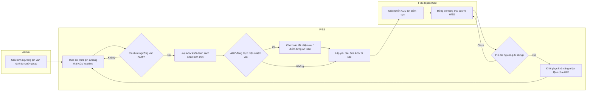

**Mô tả theo từng lane:**

- **Admin:** Cấu hình ngưỡng pin vận hành và ngưỡng sạc. **Handoff → WES.**
- **WES:** Theo dõi mức pin realtime. Khi pin xuống dưới ngưỡng vận hành, loại AGV khỏi danh sách nhận lệnh mới. Nếu AGV đang chạy → chờ hoàn tất nhiệm vụ hiện tại hoặc đưa về điểm dừng an toàn theo policy rồi mới lập yêu cầu sạc; nếu rảnh → lập yêu cầu sạc ngay. Khi pin đạt ngưỡng đủ dùng, khôi phục khả năng nhận lệnh. **Handoff → FMS.**
- **FMS (openTCS):** Điều khiển AGV tới điểm sạc và đồng bộ trạng thái sạc về WES. **Handoff → WES.**

**Bảng các bước:**

| Bước | Lane | Hành động | Đầu ra / Handoff |
| ---- | ---- | --------- | ---------------- |
| 1 | Admin → WES | Cấu hình ngưỡng pin vận hành & sạc | Ngưỡng áp vào logic theo dõi |
| 2 | WES | Theo dõi pin realtime, so với ngưỡng | Dưới ngưỡng → xử lý sạc |
| 3 | WES | Loại AGV khỏi nhận lệnh mới | AGV không được giao việc mới |
| 4 | WES | Kiểm tra AGV đang chạy? Nếu có → chờ điểm dừng an toàn | Sẵn sàng đưa đi sạc |
| 5 | WES → FMS | Lập yêu cầu sạc | FMS điều khiển AGV tới điểm sạc |
| 6 | FMS → WES | Đồng bộ trạng thái sạc | WES theo dõi tiến độ sạc |
| 7 | WES | Khi đủ pin → khôi phục khả năng nhận lệnh | AGV quay lại nhóm khả dụng |

**Luồng ngoại lệ:**

- Pin giảm tới ngưỡng critical khi AGV đang thực hiện nhiệm vụ → WES nâng cảnh báo cho Admin và yêu cầu FMS đưa AGV về trạng thái an toàn theo policy.

**Hậu điều kiện:** AGV pin thấp không được giao việc mới; AGV sau sạc quay lại nhóm khả dụng.

---

## WF-05 — Xác thực & tài khoản tự phục vụ (Authentication & Self-service)

**Mục tiêu nghiệp vụ:** Cho phép người dùng (Operator/Admin) đăng nhập an toàn, quản lý thông tin cá nhân và mật khẩu của chính mình.

**Điều kiện kích hoạt:** Người dùng truy cập hệ thống và cần xác thực, muốn cập nhật profile, đổi/khôi phục mật khẩu, hoặc đăng xuất khỏi hệ thống.

**Swim-lane diagram:**

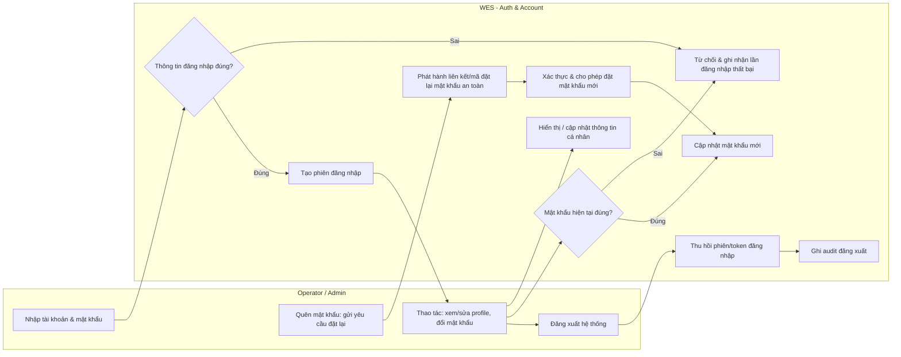

**Mô tả theo từng lane:**

- **Operator/Admin:** Nhập tài khoản/mật khẩu để đăng nhập; sau khi vào hệ thống có thể xem/sửa profile, đổi mật khẩu và đăng xuất; khi quên mật khẩu thì gửi yêu cầu đặt lại. **Handoff → WES.**
- **WES (Auth & Account):** Xác thực đăng nhập và tạo phiên nếu đúng, hoặc từ chối và ghi nhận lần thất bại nếu sai. Hiển thị/cập nhật thông tin cá nhân. Với đổi mật khẩu, yêu cầu xác thực mật khẩu hiện tại trước khi cập nhật. Với quên mật khẩu, phát hành liên kết/mã đặt lại an toàn rồi cho đặt mật khẩu mới sau khi xác thực. Với đăng xuất, thu hồi phiên/token và ghi audit.

**Bảng các bước:**

| Bước | Lane | Hành động | Đầu ra / Handoff |
| ---- | ---- | --------- | ---------------- |
| 1 | Operator/Admin → WES | Nhập tài khoản/mật khẩu | WES xác thực |
| 2 | WES | Xác thực: đúng → tạo phiên; sai → từ chối & ghi nhận | Phiên hợp lệ hoặc bị từ chối |
| 3 | Operator/Admin → WES | Xem/sửa profile | WES hiển thị/cập nhật thông tin |
| 4 | Operator/Admin → WES | Đổi mật khẩu | WES xác thực mật khẩu hiện tại rồi cập nhật |
| 5 | Operator/Admin → WES | Quên mật khẩu: yêu cầu đặt lại | WES phát hành liên kết/mã an toàn |
| 6 | WES | Xác thực liên kết/mã → cho đặt mật khẩu mới | Mật khẩu được cập nhật an toàn |
| 7 | Operator/Admin → WES | Đăng xuất | Phiên/token được thu hồi và ghi audit |

**Hậu điều kiện:** Người dùng được xác thực với phiên hợp lệ, hoặc phiên/token được thu hồi khi đăng xuất; thông tin cá nhân/mật khẩu được cập nhật an toàn.

---

## WF-06 — Quản trị người dùng & phân quyền (Admin User Management)

**Mục tiêu nghiệp vụ:** Cho phép Admin quản lý vòng đời tài khoản và phân quyền theo vai trò.

**Điều kiện kích hoạt:** Admin cần xem danh sách/chi tiết người dùng, tạo/sửa/khóa tài khoản, gán-gỡ vai trò hoặc đặt lại mật khẩu cho người dùng khác.

**Swim-lane diagram:**

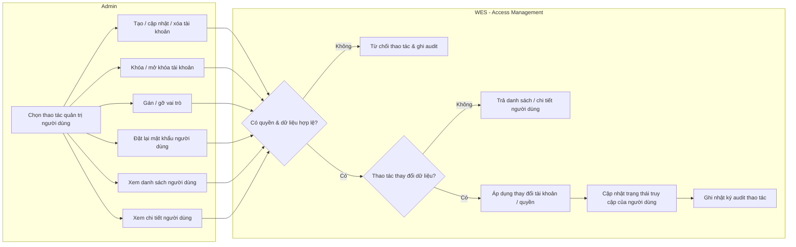

**Mô tả theo từng lane:**

- **Admin:** Chọn và thực hiện các thao tác quản trị: xem danh sách/chi tiết người dùng, tạo/cập nhật/xóa tài khoản, khóa/mở khóa, gán/gỡ vai trò, đặt lại mật khẩu cho người dùng khác. **Handoff → WES.**
- **WES (Access Management):** Kiểm tra quyền và tính hợp lệ của dữ liệu; nếu không đạt → từ chối và ghi audit. Với thao tác xem, trả danh sách/chi tiết theo phạm vi quyền. Với thao tác thay đổi, áp dụng thay đổi tài khoản/quyền, cập nhật trạng thái truy cập của người dùng và ghi nhật ký audit.

**Bảng các bước:**

| Bước | Lane | Hành động | Đầu ra / Handoff |
| ---- | ---- | --------- | ---------------- |
| 1 | Admin | Chọn thao tác quản trị (xem danh sách/chi tiết, tạo/sửa/xóa/khóa/role/reset) | Gửi yêu cầu quản trị |
| 2 | Admin → WES | Gửi thao tác kèm dữ liệu hoặc tiêu chí truy vấn | WES kiểm tra quyền & dữ liệu |
| 3 | WES | Kiểm hợp lệ: không đạt → từ chối & ghi audit | Thao tác bị chặn nếu sai |
| 4 | WES | Nếu là thao tác xem → trả danh sách/chi tiết người dùng | Admin xem dữ liệu quản trị |
| 5 | WES | Nếu là thao tác thay đổi → áp dụng thay đổi tài khoản/quyền | Cập nhật trạng thái truy cập |
| 6 | WES | Ghi nhật ký audit cho thao tác nhạy cảm/thay đổi | Thao tác được lưu vết |

**Hậu điều kiện:** Admin xem được dữ liệu người dùng theo quyền; tài khoản và quyền được cập nhật khi có thay đổi; mọi thao tác nhạy cảm/thay đổi đều được lưu vết trong audit trail.

---

## WF-07 — Cấu hình bản đồ & topology vận hành

**Mục tiêu nghiệp vụ:** Thiết lập bản đồ QR grid, point, path, location, block làm nền tảng cho định vị, dẫn đường và điều phối.

**Điều kiện kích hoạt:** Admin hoặc Operator được phân quyền cấu hình upload/thay thế bản đồ, hoặc cấu hình các thực thể topology.

**Swim-lane diagram:**

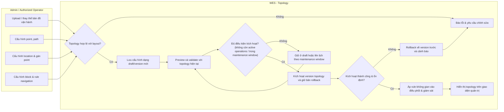

**Mô tả theo từng lane:**

- **Admin / Authorized Operator:** Upload/thay thế bản đồ và cấu hình point, path, location (gán point), block cùng rule navigation (một chiều/hai chiều, giới hạn AGV trong block...). Operator chỉ tham gia khi được phân quyền cấu hình; mọi thay đổi topology được kiểm quyền và ghi audit. **Handoff → WES.**
- **WES (Topology):** Kiểm tra tính hợp lệ với layout thực tế; nếu lỗi → yêu cầu chỉnh sửa. Khi hợp lệ → lưu cấu hình thành draft/version mới, preview và validate với topology hiện tại, active operations và các resource đang bị chiếm. Chỉ kích hoạt khi đủ điều kiện theo policy (không còn nhiệm vụ/AGV đang chạy phụ thuộc hoặc đang trong maintenance window); nếu chưa đủ điều kiện → giữ ở draft hoặc lên lịch kích hoạt theo maintenance window. Sau kích hoạt, nếu phát hiện lỗi/không ổn định → rollback về version trước và cảnh báo; nếu thành công → áp rule không gian (gồm rule không đi xuyên hàng, hướng tiếp cận) vào điều phối/giám sát và hiển thị topology để đối soát.

**Bảng các bước:**

| Bước | Lane | Hành động | Đầu ra / Handoff |
| ---- | ---- | --------- | ---------------- |
| 1 | Admin/Authorized Operator | Upload/thay thế bản đồ, cấu hình point/path/location/block | Gửi cấu hình topology |
| 2 | … → WES | Gửi cấu hình để kiểm tra | WES kiểm hợp lệ với layout |
| 3 | WES | Không hợp lệ → báo lỗi & yêu cầu chỉnh sửa | Quay lại bước cấu hình |
| 4 | WES | Hợp lệ → lưu draft/version mới, preview và validate | Cấu hình sẵn sàng kích hoạt |
| 5 | WES | Kiểm tra active operations/resource và maintenance window | Đủ điều kiện → activate; không → giữ draft/lên lịch |
| 6 | WES | Kích hoạt version topology và giữ bản rollback | Topology được kích hoạt có khả năng rollback |
| 7 | WES | Kiểm tra ổn định sau kích hoạt; lỗi → rollback version trước & cảnh báo | Giữ vận hành an toàn |
| 8 | WES | Áp rule không gian & hiển thị topology | Phản ánh vào điều phối/giám sát |

**Hậu điều kiện:** Topology vận hành được lưu theo version, kích hoạt có kiểm soát, có khả năng rollback và phản ánh đúng vào logic điều phối.

---

## WF-08 — Giám sát vận hành & phát hiện bất thường

**Mục tiêu nghiệp vụ:** Cung cấp bức tranh vận hành thời gian thực và cảnh báo sớm các bất thường (hotspot, ùn tắc, AGV lỗi nhiều).

**Điều kiện kích hoạt:** Hệ thống vận hành liên tục; dữ liệu trạng thái AGV và yêu cầu được cập nhật realtime.

**Swim-lane diagram:**

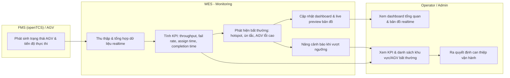

**Mô tả theo từng lane:**

- **FMS (openTCS) / AGV:** Liên tục phát sinh trạng thái AGV và tiến độ thực thi. **Handoff → WES.**
- **WES (Monitoring):** Thu thập và tổng hợp dữ liệu realtime; tính các KPI chính (throughput, fail rate, assign time, completion time); phát hiện bất thường (hotspot, ùn tắc, AGV lỗi nhiều); cập nhật dashboard & live preview; nâng cảnh báo khi vượt ngưỡng. **Handoff → Operator/Admin.**
- **Operator/Admin:** Theo dõi dashboard, KPI và danh sách khu vực/AGV bất thường để ra quyết định can thiệp.

**Bảng các bước:**

| Bước | Lane | Hành động | Đầu ra / Handoff |
| ---- | ---- | --------- | ---------------- |
| 1 | FMS/AGV → WES | Phát sinh trạng thái AGV & tiến độ | WES nhận dữ liệu realtime |
| 2 | WES | Thu thập, tổng hợp & tính KPI | KPI vận hành |
| 3 | WES | Phát hiện bất thường, nâng cảnh báo khi vượt ngưỡng | Cảnh báo hotspot/ùn tắc/AGV lỗi |
| 4 | WES → Operator/Admin | Cập nhật dashboard, live preview, danh sách bất thường | Người dùng nắm tình hình |
| 5 | Operator/Admin | Ra quyết định can thiệp vận hành | Hành động vận hành |

**Hậu điều kiện:** Tình trạng vận hành được giám sát liên tục; bất thường được phát hiện và cảnh báo kịp thời.

---

## WF-09 — Hủy yêu cầu vận chuyển (Cancellation Handling)

**Mục tiêu nghiệp vụ:** Cho phép Operator/Admin hủy một yêu cầu vận chuyển trong các trạng thái cho phép, đồng bộ với openTCS qua withdrawal API và giải phóng resource liên quan.

**Điều kiện kích hoạt:** Operator/Admin chọn hủy một yêu cầu vận chuyển ở trạng thái được phép (`PENDING`, `VALIDATING`, `WAITING_DISPATCH`, `BLOCKED`, `DISPATCHING`, hoặc `EXECUTING`).

**Tiền điều kiện:** Yêu cầu vận chuyển tồn tại; người thao tác có quyền phù hợp; trạng thái hiện tại nằm trong nhóm được phép hủy.

**Swim-lane diagram:**

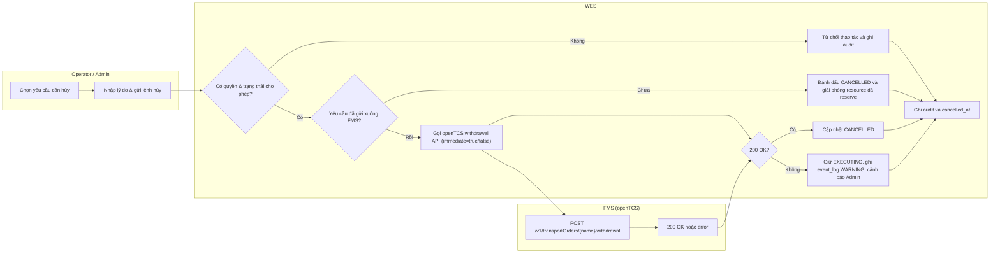

**Mô tả theo từng lane:**

- **Operator/Admin:** Chọn yêu cầu cần hủy và nhập lý do. Operator chỉ hủy trong phạm vi trạng thái được phép; Admin can thiệp rộng hơn theo policy. **Handoff → WES.**
- **WES:** Kiểm tra quyền và trạng thái. Không hợp lệ → từ chối + ghi audit. Hợp lệ → nếu chưa gửi FMS (PENDING/VALIDATING/WAITING_DISPATCH/BLOCKED) → đánh dấu `CANCELLED` ngay và giải phóng resource đã reserve. Nếu đã gửi FMS (DISPATCHING/EXECUTING) → gọi openTCS withdrawal API (synchronous). 200 OK → `CANCELLED`; error → giữ nguyên `EXECUTING`, ghi `event_log` WARNING kèm `correlation_id` và cảnh báo Admin — openTCS tiếp tục thực thi và WES nhận đồng bộ khi transport order kết thúc tự nhiên. Cuối cùng ghi audit và `cancelled_at`. **Handoff ↔ FMS.**
- **FMS (openTCS):** Nhận lệnh withdrawal, xử lý immediate hoặc regular, trả 200 OK hoặc error code. Hành vi AGV (dừng an toàn, hoàn tất chặng hiện tại) do FMS quản lý nội bộ.

**Bảng các bước:**

| Bước | Lane | Hành động | Đầu ra / Handoff |
| ---- | ---- | --------- | ---------------- |
| 1 | Operator/Admin → WES | Chọn yêu cầu & gửi lệnh hủy kèm lý do | WES kiểm tra quyền & trạng thái |
| 2 | WES | Không hợp lệ → từ chối & ghi audit | Kết thúc |
| 3 | WES | Chưa gửi FMS → CANCELLED ngay & giải phóng resource | Kết thúc sớm, resource sẵn sàng |
| 4 | WES → FMS | Đã gửi FMS → gọi withdrawal API | FMS xử lý hủy transport order |
| 5 | FMS → WES | 200 OK → CANCELLED; error → giữ EXECUTING + log WARNING + cảnh báo | Trạng thái nhất quán |
| 6 | WES | Ghi audit và cancelled_at | Audit trail hoàn chỉnh |

**Luồng ngoại lệ:**

- openTCS trả lỗi (withdrawal thất bại): WES giữ `EXECUTING`, ghi `event_log` WARNING kèm `correlation_id`. Transport order tiếp tục chạy ở FMS và khi kết thúc tự nhiên, WES nhận đồng bộ và cập nhật `COMPLETED` hoặc `FAILED`.
- Yêu cầu đã `COMPLETED` trước khi lệnh hủy tới FMS: giữ `COMPLETED`, ghi audit thao tác hủy thất bại do trạng thái đã thay đổi.

**Hậu điều kiện:** Yêu cầu kết thúc ở `CANCELLED` hoặc tiếp tục `EXECUTING` nếu withdrawal thất bại (sẽ chuyển sang `COMPLETED`/`FAILED` khi kết thúc tự nhiên); audit trail đầy đủ.

---

## WF-10 — Nhật ký sự kiện & audit trail (Event Log & Audit Trail)

**Mục tiêu nghiệp vụ:** Ghi nhận đầy đủ sự kiện vận hành và thao tác người dùng để phục vụ giám sát, truy vết sự cố, kiểm tra thay đổi cấu hình và xuất báo cáo.

**Điều kiện kích hoạt:** Có sự kiện vận hành phát sinh từ WES/FMS/AGV, hoặc có thao tác người dùng làm thay đổi dữ liệu/trạng thái quan trọng như AGV, topology, cấu hình điều phối, tài khoản, yêu cầu vận chuyển.

**Tiền điều kiện:** Các module nghiệp vụ phát sinh event theo format thống nhất; người dùng có quyền phù hợp khi xem, lọc hoặc xuất log.

**Swim-lane diagram:**

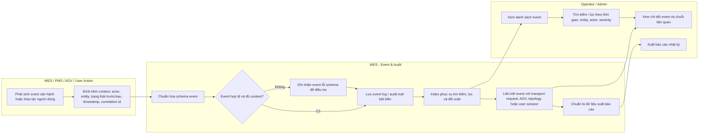

**Mô tả theo từng lane:**

- **WES / FMS / AGV / User Action (nguồn):** Phát sinh event (vận hành hoặc thao tác người dùng) kèm context tối thiểu: actor/source, entity liên quan, loại hành động, timestamp, severity, correlation id. **Handoff → WES (Event & Audit).**
- **WES (Event & Audit):** Chuẩn hóa schema, kiểm tra context, lưu event/audit theo hướng bất biến và index để phục vụ tìm kiếm. Với thay đổi quan trọng, lưu trạng thái trước/sau hoặc diff đủ để truy vết. Liên kết event với transport request, AGV, topology, cấu hình điều phối hoặc user session để dựng được chuỗi nguyên nhân–kết quả. **Handoff → Operator/Admin.**
- **Operator/Admin:** Xem danh sách, lọc/tìm kiếm, mở chi tiết event và xuất báo cáo theo quyền. Operator xem phạm vi vận hành; Admin xem đầy đủ audit và lịch sử thay đổi cấu hình.

**Bảng các bước:**

| Bước | Lane | Hành động | Đầu ra / Handoff |
| ---- | ---- | --------- | ---------------- |
| 1 | WES/FMS/AGV/User | Phát sinh event + đính kèm context | Gửi event sang Event & Audit |
| 2 | WES | Chuẩn hóa schema & kiểm tra context | Thiếu context → ghi nhóm lỗi schema |
| 3 | WES | Lưu event/audit bất biến & index | Sẵn sàng tìm kiếm/lọc |
| 4 | WES | Liên kết event với entity & dựng chuỗi liên quan | Truy vết nguyên nhân–kết quả |
| 5 | WES → Operator/Admin | Cung cấp danh sách, chi tiết & dữ liệu báo cáo | Người dùng xem/lọc/xuất |
| 6 | Operator/Admin | Tìm kiếm, xem chi tiết, xuất báo cáo | Phục vụ giám sát & truy vết |

**Luồng ngoại lệ:**

- Event thiếu context bắt buộc → vẫn ghi nhận dưới nhóm lỗi schema để không mất dấu, đồng thời cảnh báo đội vận hành/kỹ thuật.
- Người dùng không đủ quyền xem audit nhạy cảm → từ chối truy cập và ghi audit cho chính thao tác bị từ chối.
- Xuất báo cáo quá lớn → yêu cầu lọc hẹp hơn hoặc xử lý bất đồng bộ theo policy.

**Hậu điều kiện:** Sự kiện và thao tác quan trọng được lưu vết đầy đủ; người dùng có thể tìm kiếm, lọc, xem chi tiết chuỗi liên quan và xuất báo cáo phục vụ truy vết.

---

## WF-11 — Quản lý đội AGV & khả năng tham gia điều phối (AGV Fleet Management)

**Mục tiêu nghiệp vụ:** Quản lý danh sách AGV, trạng thái vận hành, khả năng nhận lệnh, chế độ ignore/restore và lịch sử hoạt động/lỗi để WES chỉ điều phối các AGV phù hợp.

**Điều kiện kích hoạt:** Admin xem/tìm kiếm/lọc AGV, xem chi tiết/lịch sử, tạo/cập nhật/xóa AGV, bật/tắt khả năng nhận lệnh hoặc ignore/khôi phục AGV; FMS/openTCS đồng bộ trạng thái AGV theo thời gian thực.

**Tiền điều kiện:** Admin có quyền quản lý đội xe; mã AGV/mapping với openTCS được định nghĩa rõ; WES nhận được dữ liệu trạng thái tối thiểu từ FMS hoặc cấu hình nội bộ.

**Swim-lane diagram:**

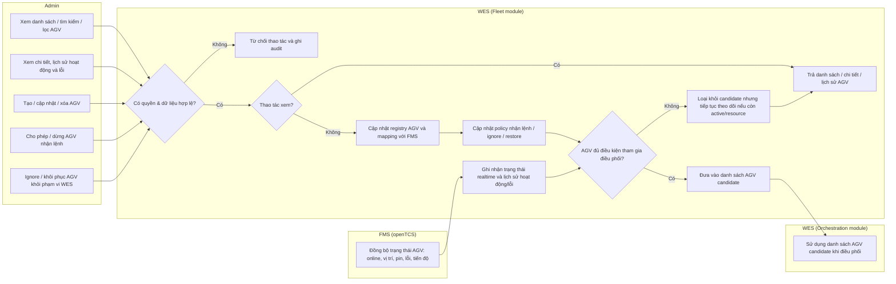

**Mô tả theo từng lane:**

- **Admin:** Quản lý danh sách AGV, xem trạng thái/chi tiết/lịch sử, cập nhật thông tin định danh, bật/tắt khả năng nhận lệnh và ignore/khôi phục AGV khỏi phạm vi điều phối nghiệp vụ. **Handoff → WES.**
- **FMS (openTCS):** Đồng bộ trạng thái thực thi của AGV như online/offline, vị trí, pin, lỗi và tiến độ nhiệm vụ. **Handoff → WES.**
- **WES (Fleet module):** Kiểm tra quyền và dữ liệu, quản lý registry AGV, mapping với FMS, policy nhận lệnh/ignore, trạng thái realtime và lịch sử hoạt động/lỗi. WES tính danh sách AGV candidate cho điều phối dựa trên policy nội bộ, trạng thái từ FMS, ngưỡng pin và trạng thái resource.
- **WES (Orchestration module):** Chỉ sử dụng danh sách AGV candidate khi gán việc, tránh giao nhiệm vụ cho AGV bị dừng nhận lệnh, bị ignore, offline, lỗi hoặc không đủ điều kiện vận hành.

> Lưu ý: `WES (Fleet module)` và `WES (Orchestration module)` là hai module bên trong cùng một hệ thống WES, được tách lane để thể hiện rõ ranh giới trách nhiệm (quản lý đội xe vs gán việc), không phải hai hệ thống riêng biệt.

**Bảng các bước:**

| Bước | Lane | Hành động | Đầu ra / Handoff |
| ---- | ---- | --------- | ---------------- |
| 1 | Admin → WES | Xem/tìm kiếm/lọc AGV hoặc xem chi tiết/lịch sử | WES kiểm quyền và trả dữ liệu |
| 2 | Admin → WES | Tạo/cập nhật/xóa AGV hoặc cấu hình nhận lệnh/ignore | WES kiểm quyền & dữ liệu |
| 3 | FMS → WES | Đồng bộ trạng thái AGV realtime | WES cập nhật trạng thái và lịch sử |
| 4 | WES | Cập nhật registry, mapping FMS và policy điều phối | Dữ liệu đội xe nhất quán |
| 5 | WES | Tính AGV có đủ điều kiện tham gia điều phối hay không | Danh sách candidate được cập nhật |
| 6 | WES → Orchestration | Cung cấp danh sách AGV candidate | Orchestration dùng để gán việc |

**Luồng ngoại lệ:**

- Mã AGV trùng, thiếu mapping FMS hoặc dữ liệu cấu hình sai → từ chối thao tác và ghi audit.
- Admin muốn xóa AGV đang active, đang nhận nhiệm vụ hoặc còn chiếm resource → từ chối xóa; đề xuất dừng nhận lệnh hoặc ignore theo policy.
- FMS mất đồng bộ hoặc AGV không cập nhật quá ngưỡng → đánh dấu stale/offline, loại khỏi candidate và cảnh báo cho Admin.
- AGV bị ignore nhưng vẫn active ở tầng FMS → WES không giao việc mới nhưng vẫn hiển thị/ghi nhận trạng thái nếu AGV còn ảnh hưởng resource vận hành.

**Hậu điều kiện:** Registry AGV, trạng thái vận hành, policy nhận lệnh/ignore và danh sách AGV candidate được cập nhật nhất quán; lịch sử hoạt động/lỗi đủ để truy vết và phục vụ điều phối.

---

## Bảng ánh xạ Workflow ↔ Major Feature

| Workflow | Tên | Major Feature liên quan |
| -------- | --- | ----------------------- |
| WF-01 | Vòng đời yêu cầu vận chuyển | FE-03, FE-04 |
| WF-02 | Điều phối & thứ tự lấy hàng | FE-04 |
| WF-03 | Xử lý yêu cầu không hợp lệ | FE-03 |
| WF-04 | Quản lý pin & sạc AGV | FE-01 (battery/charging), FE-04 |
| WF-05 | Xác thực & tài khoản tự phục vụ | FE-07 |
| WF-06 | Quản trị người dùng & phân quyền | FE-07 |
| WF-07 | Cấu hình bản đồ & topology | FE-02 |
| WF-08 | Giám sát vận hành & bất thường | FE-06 |
| WF-09 | Hủy / dừng yêu cầu vận chuyển | FE-03, FE-04, FE-08 |
| WF-10 | Nhật ký sự kiện & audit trail | FE-08 |
| WF-11 | Quản lý đội AGV & khả năng tham gia điều phối | FE-01 (fleet management) |
