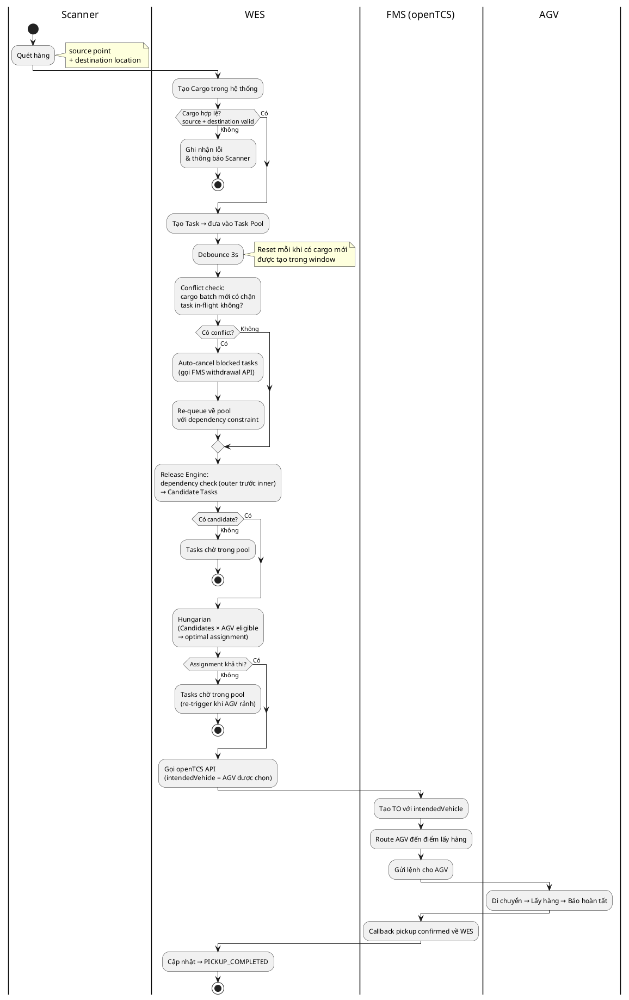
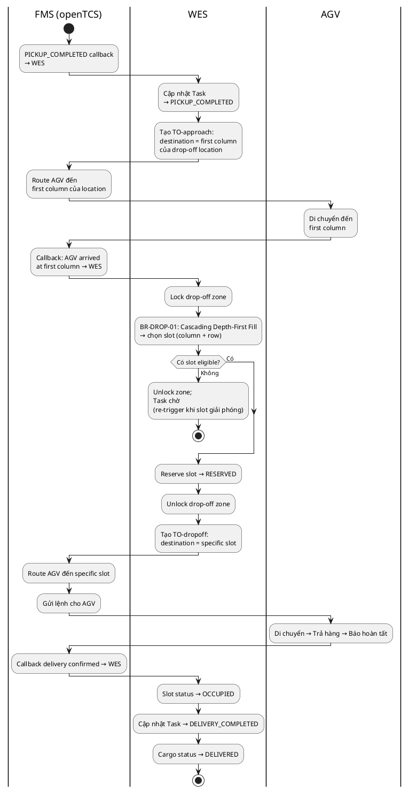
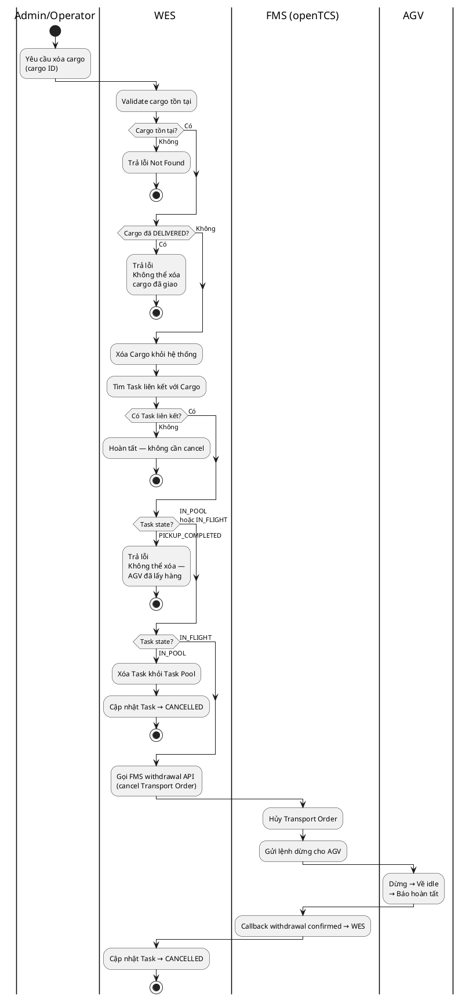
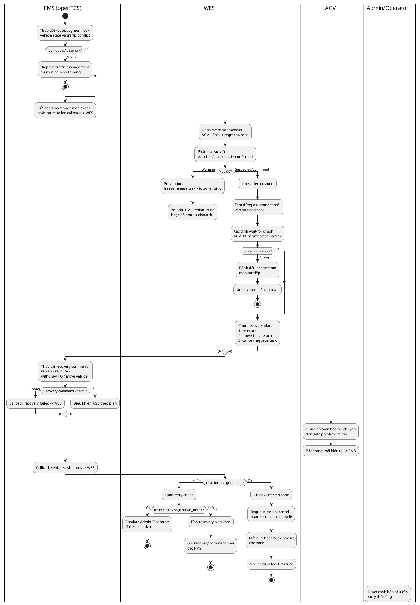

# Main Flows — SWES

Tài liệu mô tả 4 luồng nghiệp vụ chính (main flows) của SWES. Mỗi main flow trình bày mục tiêu nghiệp vụ, điều kiện kích hoạt, sơ đồ swim-lane, bảng các bước và luồng ngoại lệ.

**Các actor tham gia:**

- `Scanner`: người quét hàng tại hiện trường.
- `WES`: lớp điều phối nghiệp vụ (hệ thống đang xây dựng). Bao gồm Task Pool, Release Engine và Task Assignment engine.
- `FMS (openTCS)`: tầng thực thi đội xe — routing, traffic management, MAPF và giao tiếp AGV. Nhận Transport Order đã được WES gán xe sẵn (`intendedVehicle`).
- `AGV`: xe tự hành thực hiện di chuyển và thao tác lấy/trả hàng.

---

## MF-01 — Lấy hàng (Pickup)

**Mục tiêu nghiệp vụ:** Từ thao tác quét hàng, tạo cargo và task, phát hiện conflict với tasks đang chạy, gán AGV tối ưu và điều phối AGV đến lấy hàng thành công.

**Điều kiện kích hoạt:** Scanner quét hàng, cung cấp source point và destination location.

**Tiền điều kiện:** Topology và location đã được cấu hình; Scanner đã xác thực.

**Swim-lane diagram:**



**Mô tả theo từng lane:**

- **Scanner:** Quét hàng, cung cấp source point và destination location. **Handoff → WES.**
- **WES:** Tạo Cargo, validate source point và destination location trong topology. Nếu không hợp lệ → ghi lỗi và thông báo. Nếu hợp lệ → tạo Task, đưa vào **Task Pool**, bắt đầu debounce 3s (reset mỗi khi có cargo mới trong window). Sau debounce → **conflict check**: cargo batch mới có nằm ở outer position chặn task đang in-flight không? Nếu có → auto-cancel blocked tasks qua FMS withdrawal API và re-queue về pool với dependency constraint. Tiếp theo, **Release Engine** lọc Task Pool theo dependency rule (outer trước inner) ra Candidate Tasks. **Hungarian algorithm** chạy trên Candidates × AGV eligible → optimal assignment. Sau khi assign → gọi openTCS API với `intendedVehicle`. Nhận callback pickup confirmed, cập nhật `PICKUP_COMPLETED`. **Handoff → FMS.**
- **FMS (openTCS):** Nhận lệnh từ WES, tạo TO với xe đã xác định, route và gửi lệnh cho AGV. Callback kết quả về WES. **Handoff ↔ AGV.**
- **AGV:** Di chuyển, lấy hàng, báo hoàn tất về FMS. **Handoff → FMS.**

**Bảng các bước:**

| Bước | Lane          | Hành động                                                      | Đầu ra / Handoff                           |
| ---- | ------------- | -------------------------------------------------------------- | ------------------------------------------ |
| 1    | Scanner → WES | Quét hàng: source point + destination location                 | WES tạo Cargo                              |
| 2    | WES           | Validate source point + destination location trong topology    | Hợp lệ → tiếp; không → ghi lỗi + thông báo |
| 3    | WES           | Tạo Task → đưa vào Task Pool                                   | Task chờ trong pool                        |
| 4    | WES           | Debounce 3s (reset nếu có cargo mới trong window)              | Sau 3s → trigger conflict check            |
| 5    | WES           | Conflict check: cargo mới có chặn task in-flight không?        | Có → cancel + re-queue; không → tiếp       |
| 6    | WES → FMS     | Auto-cancel blocked tasks qua withdrawal API (nếu có conflict) | Blocked tasks về pool với dependency       |
| 7    | WES           | Release Engine: dependency check → Candidate Tasks             | Tập task eligible để assign                |
| 8    | WES           | Hungarian (Candidates × AGV eligible) → optimal assignment     | Mỗi task được gán AGV cụ thể               |
| 9    | WES → FMS     | Gọi openTCS API với intendedVehicle = AGV được chọn            | FMS tạo TO và thực thi                     |
| 10   | FMS → AGV     | Route + gửi lệnh điều khiển                                    | AGV nhận nhiệm vụ                          |
| 11   | AGV           | Di chuyển → lấy hàng → báo hoàn tất                            | Pickup completed                           |
| 12   | FMS → WES     | Callback pickup confirmed                                      | WES cập nhật → `PICKUP_COMPLETED`          |

**Luồng ngoại lệ:**

- **Cargo không hợp lệ:** source point hoặc destination location không trong topology → ghi lỗi, thông báo Scanner.
- **Task bị block bởi dependency:** outer chưa lấy → nằm pool, re-trigger khi outer task hoàn tất.
- **Không có AGV eligible:** candidate tasks chờ trong pool, re-trigger khi AGV trở thành eligible.
- **AGV gặp sự cố:** FMS callback task failed → WES cập nhật `FAILED`, ghi event log, thông báo Admin.

**Hậu điều kiện:** AGV đã lấy hàng; task ở trạng thái `PICKUP_COMPLETED`; sẵn sàng chuyển sang MF-02 (Trả hàng).

---

## MF-02 — Trả hàng (Delivery)

**Mục tiêu nghiệp vụ:** Sau khi AGV đã lấy hàng, WES điều phối AGV đến location, tính toán điểm trả cụ thể khi AGV đến cột đầu tiên của zone, và xác nhận hoàn tất.

**Điều kiện kích hoạt:** FMS callback `PICKUP_COMPLETED` → WES (tiếp nối trực tiếp từ MF-01).

**Tiền điều kiện:** Task ở trạng thái `PICKUP_COMPLETED`; AGV đang giữ hàng; destination location đã xác định từ lúc scan.

**Swim-lane diagram:**



**Mô tả theo từng lane:**

- **FMS (openTCS):** Callback `PICKUP_COMPLETED`. Route AGV đến first column của drop-off location (TO-approach). Callback khi AGV arrived. Route AGV đến specific slot (TO-dropoff). Callback delivery confirmed. **Handoff ↔ WES, AGV.**
- **WES:** Nhận `PICKUP_COMPLETED`, tạo TO-approach với destination = first column của location. Khi nhận callback "AGV arrived at first column" → lock zone → chạy **BR-DROP-01** (Cascading Depth-First Fill) để chọn slot theo arrival order (không phải pickup order). Reserve slot. Unlock zone. Tạo TO-dropoff với specific slot. Nhận callback confirmed → cập nhật `DELIVERY_COMPLETED`. **Handoff → FMS.**
- **AGV:** Di chuyển đến first column, sau đó đến specific slot. Trả hàng, báo hoàn tất. **Handoff → FMS.**

**Bảng các bước:**

| Bước | Lane      | Hành động                                                              | Đầu ra / Handoff                                       |
| ---- | --------- | ---------------------------------------------------------------------- | ------------------------------------------------------ |
| 1    | FMS → WES | Callback `PICKUP_COMPLETED`                                            | WES cập nhật trạng thái task                           |
| 2    | WES → FMS | Tạo TO-approach: destination = first column của drop-off location      | FMS route AGV đến zone entry                           |
| 3    | FMS → AGV | Route AGV đến first column                                             | AGV di chuyển                                          |
| 4    | FMS → WES | Callback: AGV arrived at first column                                  | WES bắt đầu tính slot                                  |
| 5    | WES       | Lock zone → BR-DROP-01 → chọn slot (column + row) → reserve → unlock  | Slot = RESERVED, specific drop-off point xác định      |
| 6    | WES → FMS | Tạo TO-dropoff: destination = specific slot                            | FMS route AGV đến slot                                 |
| 7    | FMS → AGV | Route + gửi lệnh đến specific slot                                     | AGV nhận nhiệm vụ                                      |
| 8    | AGV       | Di chuyển → trả hàng → báo hoàn tất                                    | Delivery completed                                     |
| 9    | FMS → WES | Callback delivery confirmed                                            | WES cập nhật slot OCCUPIED, task `DELIVERY_COMPLETED`  |

**Luồng ngoại lệ:**

- **Không có slot eligible khi AGV tới first column:** zone full hoặc tất cả eligible slots bị block → task chờ tại first column, re-trigger khi slot giải phóng.
- **AGV gặp sự cố khi đang trả:** FMS callback failed → WES cập nhật `FAILED`, release reservation (slot về EMPTY), ghi event log, thông báo Admin.
- **AGV gặp sự cố trên đường đến first column:** FMS callback failed → WES cập nhật `FAILED`, ghi event log.

**Hậu điều kiện:** AGV đã trả hàng đúng vị trí; task ở trạng thái `DELIVERY_COMPLETED`; Cargo `DELIVERED`; slot `OCCUPIED`; AGV eligible cho assignment tiếp theo.

---

## Business Rules

### BR-PICKUP-01 — Outer trước Inner (Pickup zone)

**Rule:** AGV chỉ được lấy hàng tại slot nếu tất cả slots nằm giữa slot đó và lối vào zone đều EMPTY.

**Lý do:** Warehouse layout có lối vào 1 phía. AGV không thể đi xuyên qua pallet. Slot trong cùng chỉ accessible khi các slot ngoài đã được lấy trước.

**Áp dụng tại:** Release Engine (MF-01, bước 7) — dependency check trước khi đưa task vào Candidate set.

---

### BR-DROP-01 — Cascading Depth-First Fill (Drop-off zone)

**Rule:** Khi chọn drop-off point, WES ưu tiên column xa aisle nhất, nhưng đảm bảo chênh lệch giữa các column liền kề không vượt quá MAX_DIFF. Khi bất kỳ cặp column nào vi phạm, ưu tiên fill column gần aisle hơn trước.

```
Ví dụ (3 storage columns, MAX_DIFF=2, aisle ở phải):
col1=deepest, col2=middle, col3=closest to aisle

State      Action   Lý do
(0,0,0) → col1    deepest, no violation
(1,0,0) → col1    diff=1 < MAX_DIFF
(2,0,0) → col2    col1+1 would make diff=3 > MAX_DIFF
(2,1,0) → col1    deepest, no violation
(3,1,0) → col2    col1+1 would make diff=3
(3,2,0) → col3    col2-col3=2, shallowest violation → fix first
(3,2,1) → col1    no violations, deepest first
```

**Eligibility của slot S:** S eligible khi:
1. S = EMPTY
2. Không có slot nào trên path từ aisle đến S đang OCCUPIED hoặc RESERVED (path physically clear)
3. Không có slot inner hơn S trong cùng column đang RESERVED (tránh block AGV khác đang in-transit)

**Lý do trải dàn (không fill hết 1 column):** Xe tải lấy hàng ("xe khách") đón đầu ở điểm cuối zone. Nếu hàng dồn hết 1 column, xe tải phải đi dọc toàn bộ column để lấy. Trải dàn đều theo hàng giúp xe tải lấy hàng gần điểm đón nhất, giảm quãng đường di chuyển.

**Timing:** Tính tại thời điểm AGV arrived at first column của location — không phải PICKUP_COMPLETED. Lý do: arrival order tại first column = thứ tự thực tế AGV đến zone, đảm bảo assignment theo đúng thứ tự vật lý, tránh race condition "AGV gần pickup sau nhưng đến drop zone trước."

**Áp dụng tại:** MF-02 bước 5. WES lock drop-off zone (atomic) khi chạy thuật toán, release sau khi reserve xong.

---

### BR-CONFLICT-01 — Auto-cancel khi phát hiện conflict (3s debounce)

**Rule:** Khi có cargo mới được tạo tại outer position mà outer position đó chặn task đang in-flight (AGV đang di chuyển đến pickup inner), WES tự động cancel task bị chặn và re-queue với dependency constraint.

**Trigger:** Cuối debounce window 3s sau lần tạo cargo cuối cùng trong batch.

**Lý do:** Không thể predict trước khi assign task rằng sau đó sẽ có cargo mới chặn đường. Cancel và re-queue đảm bảo Release Engine đánh giá lại dependency đúng với trạng thái hiện tại.

**Áp dụng tại:** Conflict check (MF-01, bước 5–6).

---

## MF-03 — Cancel & Xóa hàng (Cancel & Delete)

**Mục tiêu nghiệp vụ:** Xóa cargo khỏi hệ thống và hủy task vận chuyển liên quan (nếu có). Delete cargo là thao tác khởi đầu; cancel task là hệ quả bắt buộc theo sau.

**Điều kiện kích hoạt:** Admin hoặc Operator thực hiện delete cargo (UC 3.16). Nếu cargo có task liên quan, UC 3.7 (cancel transport) được thực thi ngay sau đó.

**Tiền điều kiện:** Admin/Operator đã xác thực; Cargo tồn tại trong hệ thống; Task liên quan (nếu có) chưa ở trạng thái `PICKUP_COMPLETED` hoặc `DELIVERY_COMPLETED`.

**Swim-lane diagram:**



**Mô tả theo từng lane:**

- **Admin/Operator:** Gửi yêu cầu delete cargo kèm cargo ID. **Handoff → WES.**
- **WES:** Validate cargo tồn tại, chưa `DELIVERED`, và Task liên kết (nếu có) chưa `PICKUP_COMPLETED`. Xóa Cargo. Tìm Task liên kết:
  - Nếu không có Task → kết thúc.
  - Nếu Task đang **IN_POOL** → xóa khỏi pool, cập nhật `CANCELLED`.
  - Nếu Task đang **IN_FLIGHT** → gọi FMS withdrawal API. Sau khi nhận callback confirmed → cập nhật `CANCELLED`. **Handoff → FMS.**
- **FMS (openTCS):** Nhận withdrawal request, hủy Transport Order, gửi lệnh dừng AGV. Callback confirmed về WES. **Handoff ↔ AGV.**
- **AGV:** Nhận lệnh dừng. Nếu đang giữ hàng (`PICKUP_COMPLETED`) → trả hàng về vị trí an toàn do FMS chỉ định trước khi báo hoàn tất. **Handoff → FMS.**

**Bảng các bước:**

| Bước | Lane               | Hành động                                                                 | Đầu ra / Handoff                                      |
| ---- | ------------------ | ------------------------------------------------------------------------- | ----------------------------------------------------- |
| 1    | Admin → WES        | Yêu cầu delete cargo (cargo ID)                                           | WES nhận request                                      |
| 2    | WES                | Validate cargo tồn tại và chưa `DELIVERED`                                | Hợp lệ → tiếp; không → trả lỗi                        |
| 3    | WES                | Xóa Cargo khỏi hệ thống                                                   | Cargo record removed                                  |
| 4    | WES                | Tìm Task liên kết với Cargo                                               | Xác định có Task hay không                            |
| 5a   | WES                | *(Nếu không có Task)* Kết thúc                                            | —                                                     |
| 5b   | WES                | *(Nếu Task PICKUP_COMPLETED)* Từ chối — trả lỗi nghiệp vụ                | Cargo vẫn tồn tại, task không bị ảnh hưởng            |
| 5c   | WES                | *(Nếu Task IN_POOL)* Xóa Task khỏi pool → `CANCELLED`                    | Task cancelled, pool updated                          |
| 5d   | WES → FMS          | *(Nếu Task IN_FLIGHT)* Gọi FMS withdrawal API                             | FMS hủy Transport Order                               |
| 6    | FMS → AGV          | Hủy TO, gửi lệnh dừng AGV                                                | AGV nhận lệnh dừng                                    |
| 7    | AGV                | Dừng → về idle → báo hoàn tất                                             | AGV trở về idle                                       |
| 8    | FMS → WES          | Callback withdrawal confirmed                                             | WES cập nhật Task                                     |
| 9    | WES                | Cập nhật Task → `CANCELLED`                                               | Task cancelled, AGV eligible cho assignment tiếp theo |

**Luồng ngoại lệ:**

- **Cargo không tồn tại:** WES trả lỗi Not Found, không thực hiện thêm thao tác nào.
- **Cargo đã `DELIVERED`:** WES từ chối xóa, trả lỗi nghiệp vụ — cargo đã giao không thể xóa.
- **Task đang `PICKUP_COMPLETED`:** AGV đã lấy hàng và đang trên đường đến drop zone → WES từ chối xóa, trả lỗi nghiệp vụ. Admin phải chờ AGV hoàn tất delivery trước khi thực hiện thao tác khác.
- **FMS withdrawal thất bại:** WES retry theo policy; nếu vẫn thất bại → ghi event log, thông báo Admin xử lý thủ công.
- **AGV không phản hồi lệnh dừng:** FMS escalate, ghi incident log; WES giữ Task ở trạng thái `CANCELLING` cho đến khi FMS xác nhận.

**Hậu điều kiện:** Cargo đã xóa khỏi hệ thống; Task liên kết (nếu có) ở trạng thái `CANCELLED`; AGV trở về idle, eligible cho assignment tiếp theo.

---

## MF-04 — Phát hiện & xử lý deadlock (Prevention & Recovery)

**Mục tiêu nghiệp vụ:** Phát hiện sớm nguy cơ deadlock/ùn tắc giữa nhiều AGV, phòng ngừa bằng reservation và điều phối an toàn trước khi phát sinh kẹt cứng; khi deadlock đã xảy ra thì cô lập khu vực, chọn phương án recovery ít ảnh hưởng nhất, giải phóng AGV và đưa hệ thống quay lại trạng thái vận hành ổn định.

**Điều kiện kích hoạt:**

- FMS (openTCS) phát hiện route conflict, vehicle waiting bất thường, block order, hoặc không tìm được route khả thi.
- WES watchdog phát hiện AGV/Task không tiến triển quá ngưỡng `DEADLOCK_TIMEOUT`.
- Admin/Operator ghi nhận khu vực kẹt và kích hoạt xử lý thủ công.

**Tiền điều kiện:** AGV, topology, point/segment, zone và task đang được đồng bộ giữa WES và FMS; WES nhận được telemetry/callback trạng thái từ FMS; các ngưỡng cảnh báo như `WAITING_THRESHOLD`, `DEADLOCK_TIMEOUT`, `MAX_REPLAN_RETRY` đã được cấu hình.

**Swim-lane diagram:**



**Mô tả theo từng lane:**

- **FMS (openTCS):** Theo dõi traffic runtime ở mức route/segment/point, gồm vehicle state, segment lock, conflict, route failed và AGV waiting. Khi phát hiện nguy cơ deadlock hoặc route không khả thi, FMS gửi event/callback về WES. Khi WES chọn phương án recovery, FMS thực thi replan, reroute, withdraw Transport Order hoặc move vehicle đến safe point. **Handoff ↔ WES, AGV.**
- **WES:** Nhận event từ FMS hoặc watchdog nội bộ, lấy snapshot AGV/Task/zone, phân loại mức độ `WARNING`, `SUSPECTED`, `CONFIRMED`. Với warning, WES phòng ngừa bằng cách tạm dừng release task mới vào vùng rủi ro và yêu cầu FMS replan. Với suspected/confirmed, WES lock affected zone, dựng wait-for graph để xác định cycle deadlock, chọn recovery plan theo thứ tự ít ảnh hưởng nhất: reroute, move-to-safe-point, withdraw/cancel và requeue task. Khi deadlock được giải phóng, WES unlock zone, resume/requeue task và mở lại assignment. **Handoff ↔ FMS, Admin/Operator.**
- **AGV:** Nhận lệnh từ FMS, dừng an toàn, đi theo route mới hoặc di chuyển đến safe point. AGV không tự quyết định recovery nghiệp vụ; trạng thái thực tế được báo về FMS để FMS callback cho WES. **Handoff → FMS.**
- **Admin/Operator:** Nhận cảnh báo khi hệ thống không tự recovery sau số lần retry cho phép hoặc cần can thiệp vật lý. Admin/Operator có thể xác nhận xử lý thủ công, mở khóa zone sau khi khu vực an toàn, hoặc hủy task theo quy trình vận hành. **Handoff → WES.**

**Bảng các bước:**

| Bước | Lane | Hành động | Đầu ra / Handoff |
| ---- | ---- | --------- | ---------------- |
| 1 | FMS | Theo dõi route, segment lock, vehicle state và traffic conflict | Phát hiện warning/congestion/deadlock |
| 2 | FMS → WES | Gửi event hoặc route-failed callback | WES nhận tín hiệu xử lý |
| 3 | WES | Lấy snapshot AGV + Task + affected segment/zone | Dữ liệu đủ để phân tích |
| 4 | WES | Phân loại mức độ `WARNING` / `SUSPECTED` / `CONFIRMED` | Chọn nhánh prevention hoặc recovery |
| 5a | WES | *(Warning)* Freeze release task mới vào zone rủi ro | Giảm khả năng tạo deadlock mới |
| 5b | WES → FMS | *(Warning)* Yêu cầu replan/reroute hoặc đổi thứ tự dispatch | FMS thử phương án route an toàn hơn |
| 6 | WES | *(Suspected/Confirmed)* Lock affected zone, tạm dừng assignment mới vào zone | Cô lập vùng kẹt |
| 7 | WES | Dựng wait-for graph AGV ↔ segment/point/task | Xác định có cycle deadlock hay chỉ congestion |
| 8a | WES | *(Không có cycle)* Đánh dấu congestion và tiếp tục monitor | Không kích hoạt recovery mạnh |
| 8b | WES | *(Có cycle)* Chọn recovery plan theo priority | Recovery plan được xác định |
| 9 | WES → FMS | Gửi recovery command: replan/reroute/move-to-safe-point/withdraw TO | FMS thực thi |
| 10 | FMS → AGV | Điều khiển AGV dừng an toàn hoặc đi theo route/safe point mới | AGV thay đổi trạng thái vật lý |
| 11 | AGV → FMS | Báo trạng thái hiện tại | FMS có dữ liệu callback |
| 12 | FMS → WES | Callback kết quả recovery | WES đánh giá deadlock đã giải phóng chưa |
| 13a | WES | *(Đã giải phóng)* Unlock zone, resume/requeue task, mở lại assignment | Hệ thống vận hành lại bình thường |
| 13b | WES | *(Chưa giải phóng)* Retry phương án khác nếu chưa vượt `MAX_REPLAN_RETRY` | Tiếp tục recovery |
| 13c | WES → Admin | *(Vượt retry)* Escalate xử lý thủ công, giữ zone locked | Admin/Operator can thiệp |
| 14 | WES | Ghi incident log, metrics và nguyên nhân xử lý | Có dữ liệu audit/tối ưu vận hành |

**Luồng ngoại lệ:**

- **False positive warning:** FMS/WES cảnh báo nhưng wait-for graph không có cycle. WES chỉ giữ trạng thái congestion, không cancel task; zone được unlock khi traffic trở lại bình thường.
- **Không có route thay thế:** FMS replan/reroute thất bại. WES chuyển sang phương án move-to-safe-point hoặc withdraw Transport Order theo priority recovery.
- **Safe point không khả dụng:** Tất cả safe point gần nhất bị chiếm hoặc không reachable. WES giữ affected zone locked, không release task mới vào zone và escalate Admin/Operator.
- **AGV không phản hồi:** FMS không nhận telemetry hoặc AGV không xác nhận lệnh dừng/di chuyển. WES giữ task ở trạng thái `BLOCKED` hoặc `RECOVERY_PENDING`, ghi incident log và yêu cầu xử lý thủ công.
- **Recovery vượt số lần retry:** Sau `MAX_REPLAN_RETRY`, WES không tiếp tục tự động thử để tránh làm tình trạng tệ hơn; hệ thống gửi cảnh báo Admin/Operator và giữ khóa zone cho đến khi được xác nhận an toàn.
- **Task bị withdraw nhưng AGV đang giữ hàng:** WES không xóa cargo. Task được đưa về trạng thái cần xử lý nghiệp vụ riêng (`RECOVERY_PENDING`/`MANUAL_REQUIRED`) để Admin quyết định trả hàng về safe drop point hoặc tiếp tục delivery sau khi thông đường.

**Business Rule:**

### BR-DEADLOCK-01 — Prevention trước Recovery

**Rule:** WES luôn ưu tiên phòng deadlock trước khi dùng recovery mạnh. Khi zone có dấu hiệu congestion hoặc route risk, WES phải tạm dừng release/assignment task mới vào zone đó, sau đó yêu cầu FMS replan/reroute trước khi cân nhắc withdraw/cancel task.

**Lý do:** Reroute và điều chỉnh dispatch ít ảnh hưởng hơn cancel task. Việc tiếp tục đưa task mới vào vùng đang rủi ro có thể làm tăng số AGV trong wait-for graph và biến congestion thành deadlock thật.

**Áp dụng tại:** MF-04 bước 5a-5b.

---

### BR-DEADLOCK-02 — Confirm Deadlock bằng Wait-for Graph

**Rule:** Deadlock chỉ được xem là `CONFIRMED` khi wait-for graph có cycle giữa AGV và tài nguyên bị giữ/chờ như segment, point, zone lock hoặc task dependency. Nếu không có cycle, sự kiện được xử lý như congestion/suspected deadlock.

**Lý do:** Không phải mọi trường hợp AGV đứng chờ đều là deadlock. Phân biệt congestion với cycle deadlock giúp tránh cancel hoặc withdraw task không cần thiết.

**Áp dụng tại:** MF-04 bước 7-8.

---

### BR-DEADLOCK-03 — Recovery theo mức ảnh hưởng tăng dần

**Rule:** Khi deadlock đã confirmed, WES chọn recovery theo thứ tự ưu tiên: (1) reroute/replan, (2) move một AGV đến safe point, (3) withdraw/cancel và requeue task có chi phí ảnh hưởng thấp nhất. Chỉ escalate Admin/Operator khi các phương án tự động thất bại hoặc vượt `MAX_REPLAN_RETRY`.

**Lý do:** Recovery cần giải phóng cycle nhưng vẫn hạn chế mất tiến độ vận chuyển, tránh hủy task không cần thiết và giữ trạng thái kho nhất quán.

**Áp dụng tại:** MF-04 bước 8b-13c.
